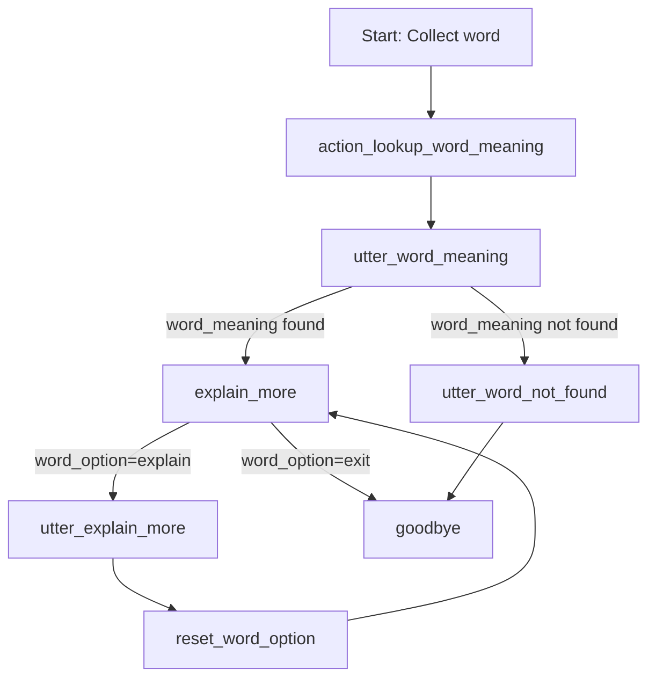

# Task: Lookup Word Meaning Flow

## 1. Define the User Intent
- **Intent name:** `lookup_word_meaning`
- **Purpose:** Detect when the user wants to look up the meaning of a word.
- **Example user messages:**
  - "What does [apple] mean?"
  - "Meaning of [computer]"
  - "Define [run]"
  - "Tra nghĩa từ [beautiful]"

## 2. Define the Slot
- **Slot name:** `word`
- **Type:** `text`
- **Purpose:** Store the word the user wants to look up.
- **Filling method:** Extract from user message (entity) or ask the user if not provided.

## 3. Create NLU Training Data
- Add examples for the `lookup_word_meaning` intent in your NLU file.
- Annotate the word as an entity if possible.

## 4. Create Responses
- **utter_ask_word:** Ask the user which word they want to look up if not provided.
  - _"Which word would you like to look up?"_
- **utter_word_meaning:** Respond with the meaning of the word.
  - _"The word '{word}' means: {meaning}"_
- **utter_word_not_found:** Respond if the word is not found.
  - _"Sorry, I couldn't find the meaning of '{word}'."_

## 5. Implement the Custom Action
- **Action name:** `action_lookup_word_meaning`
- **Purpose:** Query a dictionary API or internal database to get the word's meaning.
- **Logic:**
  - Receive the `word` slot value.
  - Look up the meaning.
  - Set a slot or use a response template to reply with the result.

## 6. Define the Flow
- **File:** `data/flows/lookup_word_meaning.yml`
- **Steps:**
  1. Collect the `word` slot (ask if not provided).
  2. Call the custom action `action_lookup_word_meaning`.
  3. Respond with the meaning or a not-found message.
  4. If meaning found, offer to explain more or exit.
  5. If explain more is chosen, provide additional explanation and return to options.
  6. If exit is chosen, end the flow.

## 7. Testing
- Test the flow with various user inputs (with and without the word provided).
- Test edge cases (unknown words, phrases, etc.).

---

**Summary Table**

| Step                | File/Component                | Description                                      |
|---------------------|------------------------------|--------------------------------------------------|
| Intent              | NLU file                     | Detect lookup requests                            |
| Slot                | Domain file                  | Store the word                                    |
| Responses           | Domain file                  | Ask for word, show meaning, handle not found      |
| Custom Action       | actions/                     | Look up the word meaning                          |
| Flow Definition     | data/flows/lookup_word_meaning.yml | Orchestrate the steps                      |
